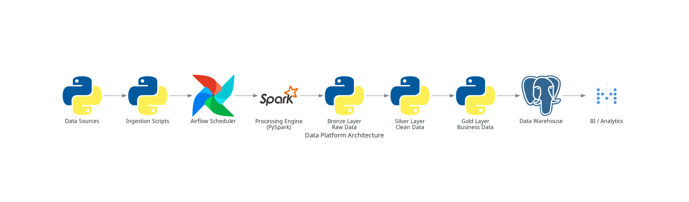
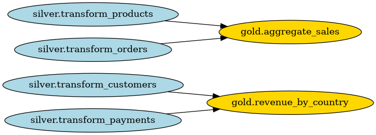
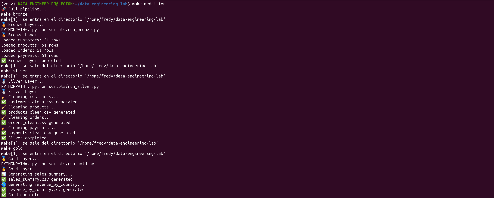
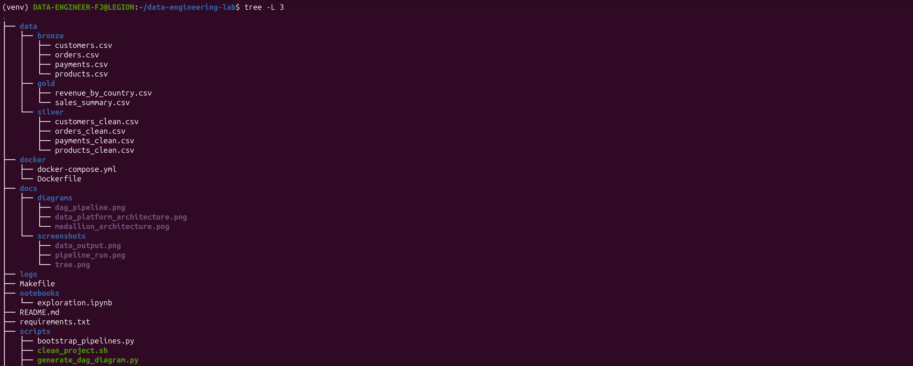
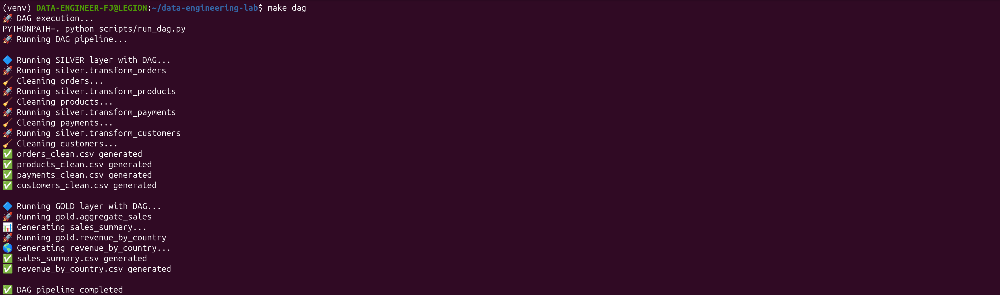
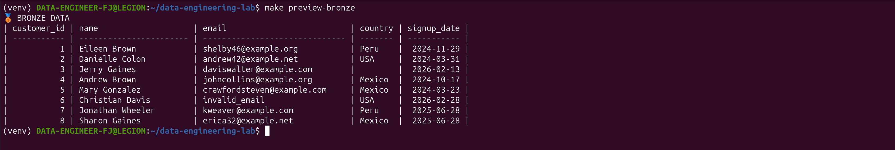
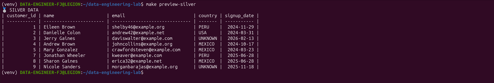
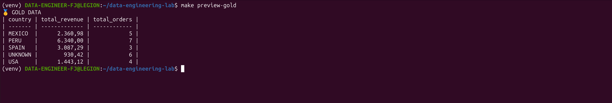

# 🚀 Data Engineering Lab – Medallion + DAG Engine

## 📌 Overview

Este proyecto simula una **plataforma moderna de ingeniería de datos**, siguiendo patrones utilizados en entornos reales:

* 🥉 **Bronze Layer** → Ingesta de datos crudos
* 🥈 **Silver Layer** → Limpieza y transformación
* 🥇 **Gold Layer** → Agregaciones de negocio
* 🔄 **DAG Engine** → Orquestación con dependencias
* ⚡ **Ejecución paralela** → Optimización del pipeline

---

## 🏗 Arquitectura de Plataforma



👉 Representa un flujo completo tipo empresa:

```text
Data Sources → Ingestion → Airflow → Spark → Medallion → Data Warehouse → BI
```

---

## 🧠 Medallion Architecture (Core del Proyecto)


Capas:

* **Bronze** → datos crudos
* **Silver** → datos limpios y estandarizados
* **Gold** → métricas de negocio

---

## ⚙️ Estructura del Proyecto

```bash
data-engineering-lab/
│
├── data/                      # 📊 Datos del pipeline
│   ├── bronze/
│   ├── silver/
│   └── gold/
│
├── docs/                      # 📚 Documentación y diagramas
│   ├── diagrams/
│   │   ├── data_platform_architecture.png
│   │   ├── medallion_architecture.png
│   │   └── dag_pipeline.png
│   │
│   └── screenshots/
│       ├── pipeline_run.png
│       ├── tree.png
│       └── data_output.png
│
├── logs/                      # 📄 Logs (opcional pero PRO)
│
├── scripts/                   # ⚙️ Orquestación simple
│   ├── generate_data.py
│   ├── run_bronze.py
│   ├── run_silver.py
│   ├── run_gold.py
│   ├── run_dag.py
│   ├── generate_dag_diagram.py
│   └── clean_project.sh
│
├── src/                       # 🧠 Lógica del negocio (CORE)
│   ├── config/
│   │   └── settings.py
│   │
│   └── pipelines/
│       ├── bronze/
│       │   ├── ingest_customers.py
│       │   ├── ingest_products.py
│       │   ├── ingest_orders.py
│       │   └── ingest_payments.py
│       │
│       ├── silver/
│       │   ├── transform_customers.py
│       │   ├── transform_products.py
│       │   ├── transform_orders.py
│       │   └── transform_payments.py
│       │
│       ├── gold/
│       │   ├── aggregate_sales.py
│       │   └── revenue_by_country.py
│       │
│       └── dag.py
│
├── versions/                  # 📦 Versionado automático
│
├── Makefile                   # 🚀 Orquestación principal
├── README.md                  # 📘 Documentación
├── requirements.txt           # 📦 Dependencias
└── .gitignore
```

---

## 🔄 Flujo del Pipeline

```text
Bronze → Silver → Gold
```

---

## 🧠 DAG (Orquestación)

El sistema ejecuta tareas respetando dependencias:

```text
transform_orders ───┐
                    ├── aggregate_sales
transform_products ─┘

transform_payments ───→ revenue_by_country
transform_customers ──→ revenue_by_country
```

---

## 📊 Visualización del DAG

Generado automáticamente:

```bash
make generate-dag
```

Salida:

<p align="lef">
  
</p>

---

## ⚡ Features

* ✔ Arquitectura Medallion
* ✔ Auto-discovery de pipelines
* ✔ Ejecución paralela
* ✔ Orquestación con DAG
* ✔ Visualización de dependencias
* ✔ Versionado del proyecto

---

## 🚀 Quick Start

```bash
make init
make generate-data
make medallion
```

---

## 🧪 Ejecución Avanzada

### Ejecutar con DAG

```bash
make dag
```

### Generar diagrama

```bash
make generate-dag
```

---

## 📂 Output del Pipeline

```bash
data/
 ├── bronze/*.csv
 ├── silver/*.csv
 └── gold/*.csv
```

---

## 📸 Evidencia del Proyecto

👉 Aquí capturas reales:

### 🔹 Ejecución del pipeline

<p align="lef">
  
</p>
<p align="lef"><i>Execution pipeline</i></p>

### 🔹 Estructura del proyecto

<p align="lef">
  
</p>
<p align="lef"><i>Project structure</i></p>

### 🔹 Output de datos
<p align="lef">
  
</p>
<p align="lef"><i>Project structure</i></p>

### 🔹 Tabla de datos Bronze
<p align="lef">
  
</p>
<p align="lef"><i>Table Bronze</i></p>

### 🔹 Tabla de datos Silver
<p align="lef">
  
</p>
<p align="lef"><i>Table Silver</i></p>

### 🔹 Tabla de datos Gold
<p align="lef">
  
</p>
<p align="lef"><i>Table Gold</i></p>

---

## 📦 Versionado

```bash
make version
```

Salida:

```bash
versions/project_YYYYMMDD_HHMMSS.tar.gz
```

---

## 🔥 Roadmap (Next Level)

* Dockerización
* Airflow real (scheduler)
* Logging estructurado
* Deploy en AWS / Azure
* Integración con Spark real / Databricks

---

---

## 👨‍💻 Autor

Fredy Johel Peña A.  
Data Engineer  

🚀 Proyecto orientado a escenarios reales de ingeniería de datos
