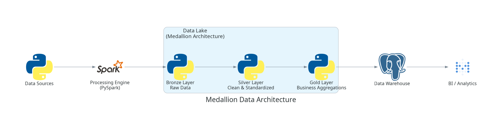
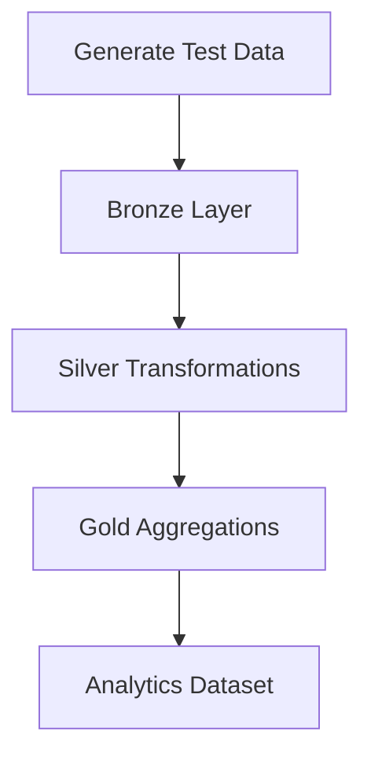
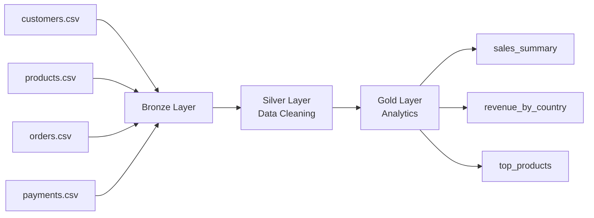
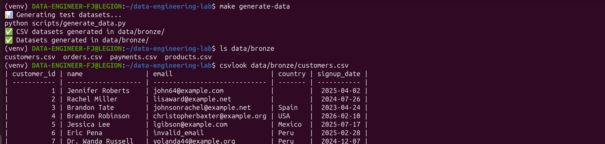
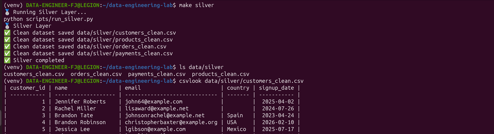
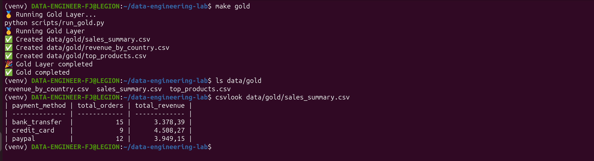

# 🚀 Data Engineering Starter Kit


Plantilla de proyecto para construir una **plataforma moderna de Data Engineering** usando arquitectura **Medallion (Bronze → Silver → Gold)**.

Este laboratorio simula el funcionamiento de una **plataforma de datos real**, incluyendo:

* generación de datasets de prueba
* pipelines organizados por capas
* automatización mediante **Makefile**
* CLI del proyecto
* generación automática de **diagramas de arquitectura**
* ejemplos visuales del flujo de transformación de datos

---

# 🏗 Data Platform Architecture

<p align="center">
  
</p>

La arquitectura representa un pipeline completo de datos desde la ingestión hasta la analítica.

Flujo general del sistema:

```text
Data Sources
      ↓
Ingestion Scripts
      ↓
Orchestration (Airflow)
      ↓
Processing Engine (Pandas / PySpark)
      ↓
Bronze Layer
      ↓
Silver Layer
      ↓
Gold Layer
      ↓
Data Warehouse
      ↓
BI / Analytics
```

### Componentes principales

**Data Sources**

Fuentes externas de datos como:

* APIs
* archivos CSV
* bases de datos operacionales

---

**Ingestion Scripts**

Scripts Python encargados de recolectar datos desde las fuentes.

---

**Processing Engine**

Motor responsable de:

* limpieza de datos
* transformaciones
* agregaciones

---

**Data Lake**

Implementa la arquitectura **Medallion**:

* Bronze → datos crudos
* Silver → datos limpiados
* Gold → datos analíticos

---

# 🥇 Medallion Architecture

<p align="center">
  
</p>

La arquitectura Medallion organiza los datos en **tres capas de calidad progresiva**.

| Layer  | Descripción      |
| ------ | ---------------- |
| Bronze | Datos crudos     |
| Silver | Datos limpiados  |
| Gold   | Datos analíticos |

---

# ⚙️ Pipeline de Datos



Flujo real del pipeline:

```text
generate_data.py
     ↓
data/bronze
     ↓
data/silver
     ↓
data/gold
```

---

# 🔎 Data Lineage

El siguiente diagrama muestra cómo fluye la información dentro del pipeline.



Este flujo representa cómo los datos pasan por:

```text
fuentes → ingestión → limpieza → métricas
```

---

# 🔬 Funcionamiento Interno del Pipeline

El pipeline completo se ejecuta mediante:

```bash
make medallion
```

Internamente ejecuta:

```text
Bronze → Silver → Gold
```

---

# 📊 Transformación Visual de Datos

A continuación se muestran ejemplos reales de cómo evolucionan los datos a través del pipeline.

---

# 🥉 Datos en Bronze (Raw Data)

Los datos en la capa Bronze se almacenan **tal como llegan desde la fuente**.

Ejemplo generado con:

```bash
make generate-data
```

<p align="center">
  
</p>

Características observadas:

* datos sin limpiar
* emails inválidos
* posibles duplicados
* valores nulos

Ejemplo:

```text
customer_id,name,email,country
1,Adam Wolfe,adam@email.com,Peru
2,John Smith,invalid_email,Chile
3,Maria Lopez,,Mexico
```

---

# 🥈 Datos en Silver (Clean Data)

Después de pasar por las transformaciones del pipeline los datos son **limpiados y estandarizados**.

Transformaciones aplicadas:

* eliminación de duplicados
* validación de emails
* normalización de columnas
* manejo de valores nulos

Ejemplo generado con:

```bash
make silver
```

<p align="center">
  
</p>

Ejemplo:

```text
customer_id,name,email,country
1,Adam Wolfe,adam@email.com,Peru
2,John Smith,NULL,Chile
3,Maria Lopez,NULL,Mexico
```

---

# 🥇 Datos en Gold (Analytics Data)

En la capa Gold se generan **datasets listos para análisis**.

Ejemplo generado con:

```bash
make gold
```

<p align="center">
  
</p>

Ejemplo de agregación:

```text
country,total_revenue,total_orders
Peru,12000,80
USA,9000,60
Mexico,5000,35
```

---

# 📈 Comparación del Pipeline

| Bronze         | Silver             | Gold                |
| -------------- | ------------------ | ------------------- |
| Raw data       | Clean data         | Analytics           |
| Sin validación | Datos normalizados | Métricas de negocio |

---

# 🛡 Data Quality & Validation

Las validaciones se aplican principalmente en la **capa Silver**.

### Validación de emails

```python
df = df[df["email"].str.contains("@", na=False)]
```

---

### Eliminación de duplicados

```python
df = df.drop_duplicates()
```

---

### Validación de valores nulos

```python
df = df.dropna(subset=["customer_id"])
```

---

### Validación de precios

```python
df = df[df["price"] > 0]
```

Estas validaciones aseguran que solo **datos confiables lleguen a la capa Gold**.

---

# 📁 Estructura del Proyecto

```text
data-engineering-lab
│
├── airflow/
├── configs/
│
├── data/
│   ├── bronze/
│   ├── silver/
│   └── gold/
│
├── docs/
│   ├── diagrams/
│   └── screenshots/
│
├── scripts/
│   ├── generate_data.py
│   ├── run_bronze.py
│   ├── run_silver.py
│   ├── run_gold.py
│
├── src/
│   └── pipelines/
│
├── tests/
│
├── Makefile
├── requirements.txt
└── README.md
```

---

# ⚙️ Comandos del Proyecto

### Inicializar entorno

```bash
make init
```

---

### Generar datos

```bash
make generate-data
```

---

### Ejecutar Bronze

```bash
make bronze
```

---

### Ejecutar Silver

```bash
make silver
```

---

### Ejecutar Gold

```bash
make gold
```

---

### Ejecutar pipeline completo

```bash
make medallion
```

---

### Preparar todo desde cero

```bash
make reset
make bootstrap
```

---

# 🗺 Roadmap del Proyecto

Este laboratorio evolucionará hacia una plataforma completa de Data Engineering.

## Fase 1 — Data Pipeline Básico

* [x] Generación de datasets simulados
* [x] Arquitectura Medallion
* [x] Pipeline Bronze → Silver → Gold
* [x] Automatización con Makefile

---

## Fase 2 — Data Processing

* [x] Limpieza de datos en Silver
* [x] Agregaciones analíticas en Gold
* [x] Data Quality checks
* [x] Capturas visuales del pipeline

---

## Fase 3 — Arquitectura de Plataforma

* [x] Diagramas de arquitectura
* [x] Diagramas Medallion
* [x] Documentación del pipeline
* [x] Data lineage

---

## Fase 4 — Próximas mejoras

* [ ] Orquestación completa con Apache Airflow
* [ ] Ingesta desde APIs reales
* [ ] Tests automatizados de calidad de datos
* [ ] Integración con Data Warehouse
* [ ] Dashboard analítico

---

# 🎯 Objetivo del Proyecto

Este repositorio sirve como laboratorio práctico para construir una **plataforma moderna de Data Engineering**, incluyendo:

* Data Pipelines
* Data Lake Architecture
* Data Quality
* Data Orchestration
* Analytics datasets

---

# 👨‍💻 Autor

Proyecto desarrollado como laboratorio práctico de **Fredy Johel Peña A. Data Engineering**.
